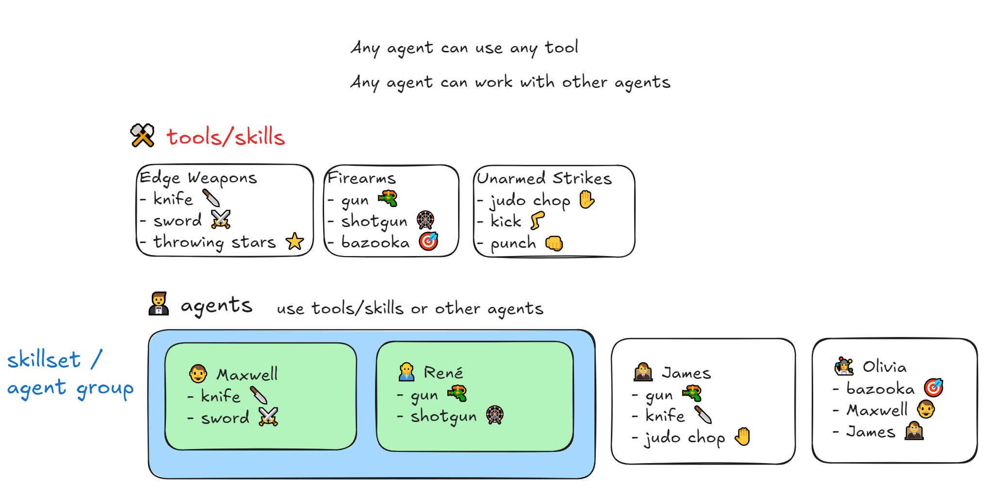
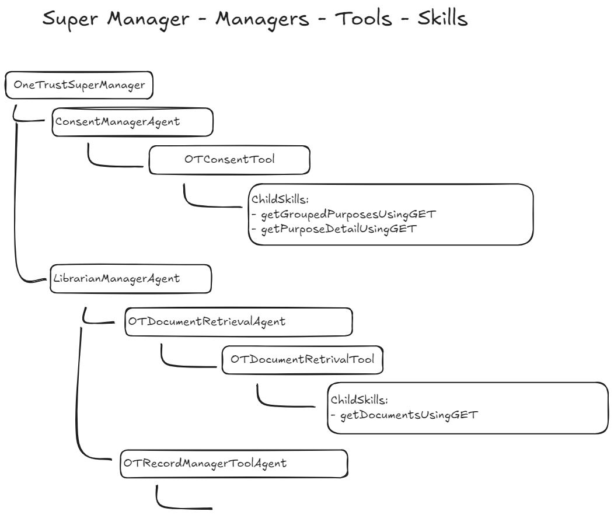

https://developer.onetrust.com/onetrust/reference/getgroupedpurposesusingget
https://developer.onetrust.com/onetrust/reference/getpurposedetailusingget

*note: schema missing 'type' argument in `api/consentmanager/v2/purposes` definitions* 

### consent questions:
What are my approved purposes for processing data?
  -> returns active purposes

What are my purposes for processing data?
  -> returns active and draft purposes

What are my active purposes for processing data for cookie type?
  -> returns active and cookie types

using onetrust consent, give me details about 39d0c533-a82b-4bcc-81c6-991057cef639 purpose
  -> returns details about that specific purpose

@OneTrust Consent Manager Agent give me details about 39d0c533-a82b-4bcc-81c6-991057cef639 purpose
  -> Exception: Microsoft.Medeina.Skills.Runtime.Exceptions.SkillExceptions.FatalSkillInvocationException: Get request to https://uat.onetrust.com/api/consentmanager/v2/purposes/%7BpurposeId%7D failed with with HTTP status: 400 BadRequest and exception: System.Net.Http.HttpRequestException: Request failed with status code BadRequest

@OneTrust Consent Tool give me details about 39d0c533-a82b-4bcc-81c6-991057cef639 purpose
  -> gets details 

promptbook for single consent purpose details (uses list and grabs id from results) :
input -> consent name of active purpose within the page limit ("Email Marketing")

@OneTrust Consent Manager Agent give me details about Email Marketing purpose
  -> runs getGroupedPurposesUsingGET and gets info from the response (doesn't run extra details step) 

what are the data elements that are approved for that purpose?
todo: what api is this?

### notes
enable Agents and AgentView flags:
https://securitycopilot.microsoft.com/?featureFlags=Agents,AgentView

# terms

# outline

